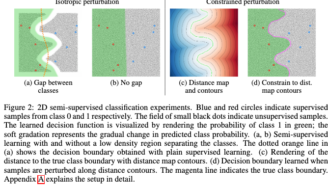

# Consistency regularization

## The issue with data augmentation
Data augmentation has become central to training most deep learning models as usually more data means better performance.
See the [paper](https://static.googleusercontent.com/media/research.google.com/en//pubs/archive/35179.pdf) of Alon Halevy, Peter Norvig, and Fernando Pereira.
The idea behind data augmentation is that, by being trained a model on many slightly distorted instances of labeled data points, the model will learn to create a smoother decision boundary.

Data-augmentation combined with other sources of randomness during training, such as dropout, model-selection, stochastic gradient descent will necessarily mean that at one point during the training, the same data-point and its data augmented set will provide different labels.
This inconsistenty of the model output might be acceptable during the training regime of a model, but not during the inference.

## Consistency regularization
Consistency regularization is a Semi-Supervised technique that, turns the issue of having this output inconsistency into an a new source of error for the training.
A loss $$ L_{cons} $$ is added to the training loss. The $$ L_{cons} $$ loss is in charge of minimizing the distance between the different outputs produced from an augmented input.

$$ 
L_{cons} =  d(f_\theta(x), f_\theta(\hat{x}))
$$

Any distance could be used, euclidean, cross-entropy, etc... it depends on the output type received.

Forcing this consistency forces the model to produce smoother decision boundaries. 
It also provides a loss usable to train on unlabeled examples!

The [publication](https://arxiv.org/pdf/1906.01916.pdf) makes a pretty good illustation, of this phenomenon.

**Consistency regularization means that you could train a classification model with few supervised samples using a cross-entropy loss, helped by unlabeled data with the consistency loss.**

## Application

This has been applied to GANs for example.
The discriminator is fed perturbed adversarial examplesand is trained to maintain decision consistency on them. 
This avoids to have an hyper sensitive discriminator that would react to very precise generator artifacts.
A discriminator with smoother bounds means that the GAN could train for longer because the generator did not discover a unique artifact hidden in a specific manifold that would have the discriminator duped. 
At least in principle...
  
## Next  
I am working on a notebook to test this idea. To be followed !

## Sources

* [Consistency regularization for GANs](https://deepai.org/publication/consistency-regularization-for-generative-adversarial-networks)
* [Semi-supervised semantic segmentation needs strong,high-dimensional perturbations](https://arxiv.org/pdf/1906.01916.pdf)
* [Regularization With Stochastic Transformations andPerturbations for Deep Semi-Supervised Learning](https://arxiv.org/pdf/1606.04586.pdf)
